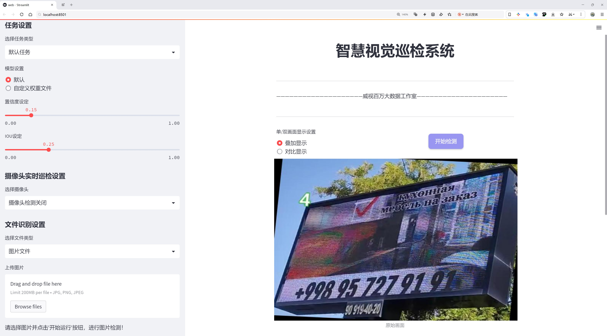
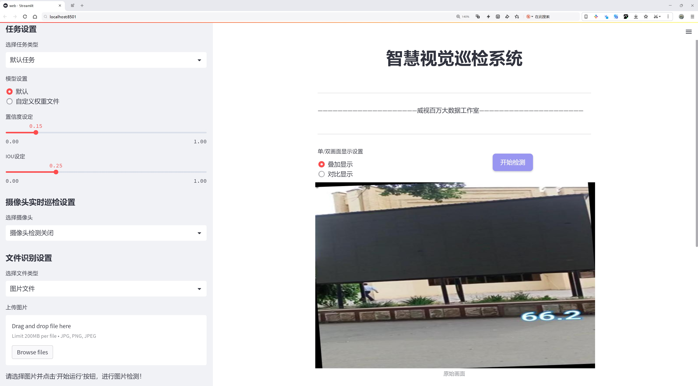
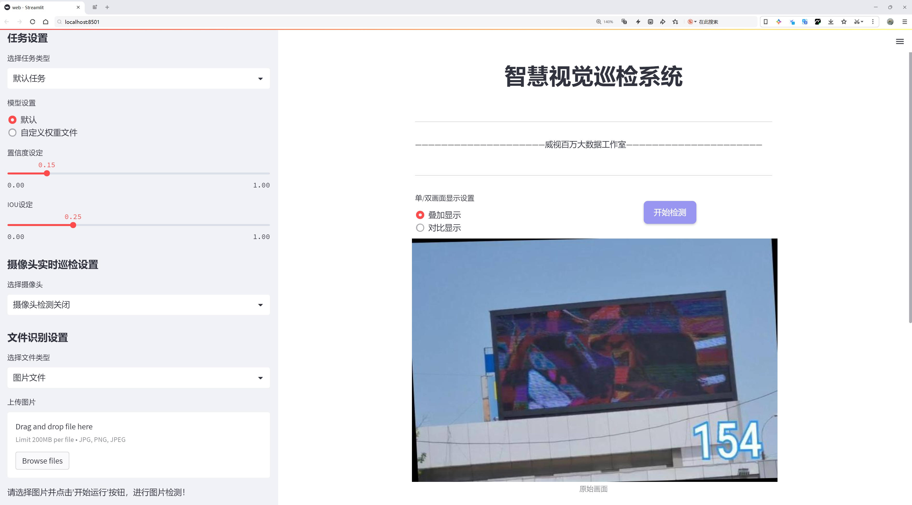
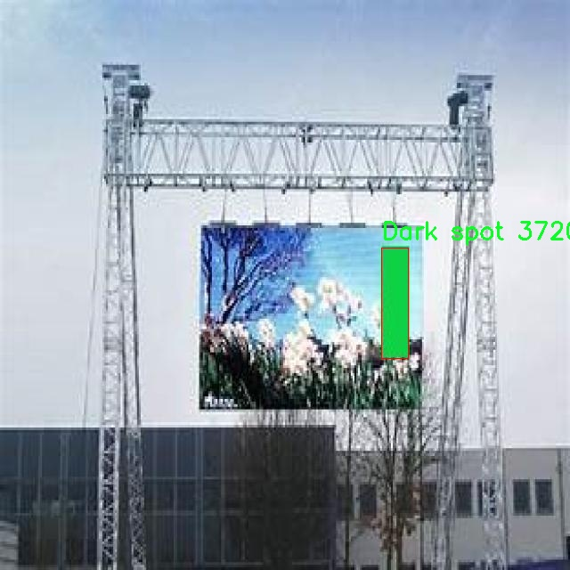
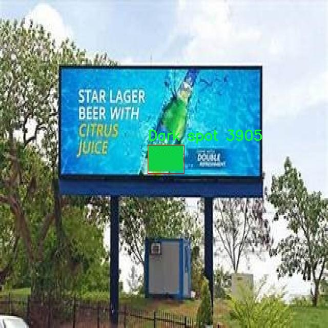
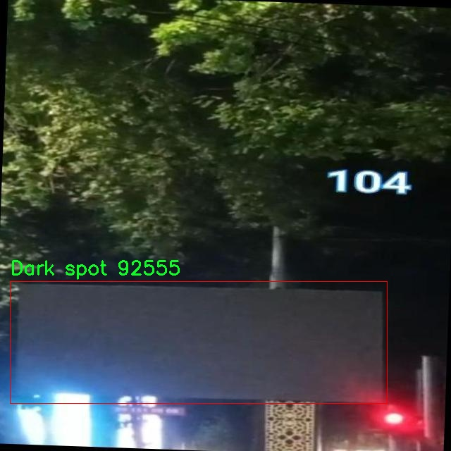
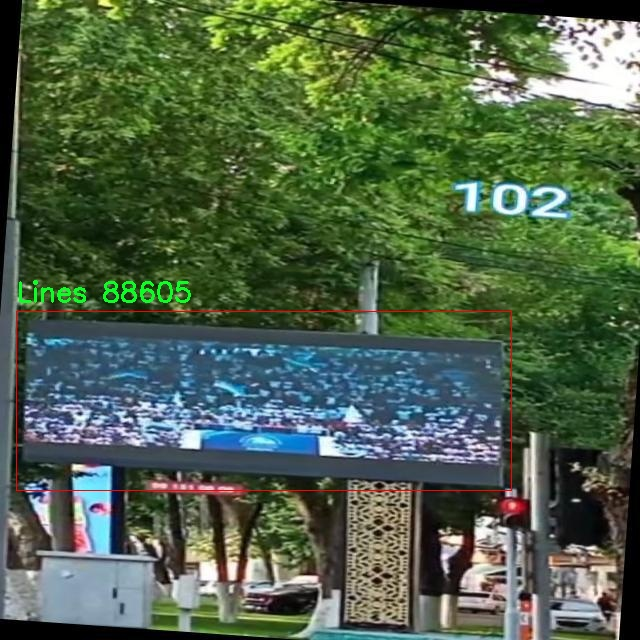

# 显示屏显示缺陷检测检测系统源码分享
 # [一条龙教学YOLOV8标注好的数据集一键训练_70+全套改进创新点发刊_Web前端展示]

### 1.研究背景与意义

项目参考[AAAI Association for the Advancement of Artificial Intelligence](https://gitee.com/qunmasj/projects)

项目来源[AACV Association for the Advancement of Computer Vision](https://kdocs.cn/l/cszuIiCKVNis)

研究背景与意义

随着信息技术的迅猛发展，显示屏作为人机交互的重要媒介，其质量直接影响用户体验和产品的市场竞争力。尤其在智能手机、电视、计算机显示器等领域，显示屏的缺陷检测已成为保障产品质量的重要环节。传统的人工检测方法不仅耗时耗力，而且容易受到人为因素的影响，导致检测结果的不稳定性和不准确性。因此，采用先进的计算机视觉技术进行自动化缺陷检测显得尤为重要。

近年来，深度学习技术的迅猛发展为目标检测领域带来了新的机遇。YOLO（You Only Look Once）系列模型因其高效的实时检测能力和良好的准确性，逐渐成为目标检测的主流方法。YOLOv8作为该系列的最新版本，进一步提升了检测精度和速度，适用于多种复杂场景。然而，尽管YOLOv8在一般目标检测任务中表现出色，但在特定应用场景下，如显示屏缺陷检测，仍存在一定的局限性。因此，基于YOLOv8的改进，构建一个高效的显示屏缺陷检测系统具有重要的理论和实践意义。

本研究将基于一个包含5364张图像的专用数据集进行缺陷检测，该数据集涵盖了三类缺陷：暗点、线条和屏幕缺陷。这些缺陷不仅影响显示效果，还可能导致用户的不满和产品的退货，进而影响企业的经济效益。因此，针对这些特定缺陷的检测，构建一个高效、准确的自动化检测系统，将为显示屏制造企业提供强有力的技术支持。

在数据集的构建过程中，考虑到显示屏缺陷的多样性和复杂性，数据集中的图像经过精心挑选，确保了不同类型缺陷的代表性和多样性。这为模型的训练和测试提供了良好的基础。同时，针对YOLOv8模型的改进，可能包括数据增强、模型结构优化、损失函数调整等方法，以提高模型在特定缺陷检测任务中的表现。

通过本研究，期望能够实现以下几个目标：首先，提升显示屏缺陷检测的准确性和实时性，为生产线上的自动化检测提供可行方案；其次，推动深度学习技术在工业应用中的进一步发展，探索其在其他领域的应用潜力；最后，为相关研究提供数据支持和理论依据，促进显示屏质量控制技术的进步。

综上所述，基于改进YOLOv8的显示屏显示缺陷检测系统的研究，不仅具有重要的学术价值，也对实际生产具有显著的应用前景。通过实现高效、准确的缺陷检测，能够有效提升显示屏的生产质量，降低企业的生产成本，增强市场竞争力，最终推动整个行业的技术进步与发展。

### 2.图片演示







##### 注意：由于此博客编辑较早，上面“2.图片演示”和“3.视频演示”展示的系统图片或者视频可能为老版本，新版本在老版本的基础上升级如下：（实际效果以升级的新版本为准）

  （1）适配了YOLOV8的“目标检测”模型和“实例分割”模型，通过加载相应的权重（.pt）文件即可自适应加载模型。

  （2）支持“图片识别”、“视频识别”、“摄像头实时识别”三种识别模式。

  （3）支持“图片识别”、“视频识别”、“摄像头实时识别”三种识别结果保存导出，解决手动导出（容易卡顿出现爆内存）存在的问题，识别完自动保存结果并导出到tempDir中。

  （4）支持Web前端系统中的标题、背景图等自定义修改，后面提供修改教程。

  另外本项目提供训练的数据集和训练教程,暂不提供权重文件（best.pt）,需要您按照教程进行训练后实现图片演示和Web前端界面演示的效果。

### 3.视频演示

[3.1 视频演示](https://www.bilibili.com/video/BV19Msbe4EYh/)

### 4.数据集信息展示

##### 4.1 本项目数据集详细数据（类别数＆类别名）

nc: 3
names: ['Dark spot', 'Lines', 'Screen']


##### 4.2 本项目数据集信息介绍

数据集信息展示

在本研究中，我们使用了名为“Red-Green”的数据集，以支持改进YOLOv8模型在显示屏显示缺陷检测系统中的应用。该数据集专门设计用于识别和分类显示屏上常见的缺陷类型，具有极高的实用价值和应用潜力。数据集的类别数量为三，具体包括“Dark spot”（黑点）、“Lines”（线条缺陷）和“Screen”（屏幕整体缺陷），这些类别涵盖了显示屏在实际使用中可能出现的主要问题。

“Dark spot”类别主要指显示屏上出现的黑色斑点，这种缺陷通常是由于显示器内部的像素失效或物理损伤造成的。黑点不仅影响了显示效果，还可能对用户的视觉体验产生负面影响，因此及时检测和修复这些缺陷显得尤为重要。数据集中包含多种不同大小和形状的黑点样本，以确保模型能够在多样化的环境中进行有效识别。

“Lines”类别则涉及到显示屏上出现的线条缺陷，这种缺陷可能是由于电路问题、屏幕老化或其他外部因素导致的。线条缺陷的存在不仅影响了图像的清晰度，还可能对图像的整体质量造成严重影响。数据集中包含了多种不同类型的线条缺陷样本，包括水平线、垂直线以及斜线等，以帮助模型学习如何识别和分类这些复杂的缺陷。

最后，“Screen”类别则代表了整体屏幕的缺陷，这些缺陷可能是由于多种因素引起的，包括色彩失真、亮度不均匀等。整体屏幕缺陷的检测对于确保显示设备的正常使用至关重要，因为这些问题往往是用户最为关注的。数据集中提供了丰富的样本，以便模型能够在不同的环境和条件下进行有效的缺陷检测。

通过对“Red-Green”数据集的深入分析和应用，我们旨在提升YOLOv8模型在显示屏缺陷检测中的准确性和鲁棒性。该数据集不仅提供了丰富的样本和多样化的缺陷类型，还为模型的训练和测试提供了坚实的基础。随着深度学习技术的不断发展，结合高质量的数据集将极大地推动显示屏缺陷检测系统的智能化进程，从而为相关行业提供更为高效和精准的解决方案。

在数据集的构建过程中，我们注重样本的多样性和代表性，以确保模型能够适应不同类型的显示屏和各种环境条件。数据集中的每个样本都经过精心标注，确保其准确性和可靠性。这一过程不仅提高了数据集的质量，也为后续的模型训练提供了坚实的基础。

总之，“Red-Green”数据集的设计和应用将为改进YOLOv8模型在显示屏缺陷检测系统中的表现提供强有力的支持，推动该领域的研究和应用向更高水平发展。通过不断优化和迭代，我们期待能够实现更高效、更智能的显示屏缺陷检测解决方案，为用户带来更优质的视觉体验。










### 5.全套项目环境部署视频教程（零基础手把手教学）

[5.1 环境部署教程链接（零基础手把手教学）](https://www.ixigua.com/7404473917358506534?logTag=c807d0cbc21c0ef59de5)


[5.2 安装Python虚拟环境创建和依赖库安装视频教程链接（零基础手把手教学）](https://www.ixigua.com/7404474678003106304?logTag=1f1041108cd1f708b01a)

### 6.手把手YOLOV8训练视频教程（零基础小白有手就能学会）

[6.1 手把手YOLOV8训练视频教程（零基础小白有手就能学会）](https://www.ixigua.com/7404477157818401292?logTag=d31a2dfd1983c9668658)

### 7.70+种全套YOLOV8创新点代码加载调参视频教程（一键加载写好的改进模型的配置文件）

[7.1 70+种全套YOLOV8创新点代码加载调参视频教程（一键加载写好的改进模型的配置文件）](https://www.ixigua.com/7404478314661806627?logTag=29066f8288e3f4eea3a4)

### 8.70+种全套YOLOV8创新点原理讲解（非科班也可以轻松写刊发刊，V10版本正在科研待更新）

由于篇幅限制，每个创新点的具体原理讲解就不一一展开，具体见下列网址中的创新点对应子项目的技术原理博客网址【Blog】：


[8.1 70+种全套YOLOV8创新点原理讲解链接](https://gitee.com/qunmasj/good)

### 9.系统功能展示（检测对象为举例，实际内容以本项目数据集为准）

图9.1.系统支持检测结果表格显示

  图9.2.系统支持置信度和IOU阈值手动调节

  图9.3.系统支持自定义加载权重文件best.pt(需要你通过步骤5中训练获得)

  图9.4.系统支持摄像头实时识别

  图9.5.系统支持图片识别

  图9.6.系统支持视频识别

  图9.7.系统支持识别结果文件自动保存

  图9.8.系统支持Excel导出检测结果数据


### 10.原始YOLOV8算法原理

原始YOLOv8算法原理

YOLOv8模型是由Ultralytics团队在YOLOv5的基础上进行创新和改进而成的，旨在提升目标检测的性能和效率。该模型于2023年1月发布，经过近两年半的实际验证，吸收了众多前沿技术与实践经验，成为YOLO系列中的最新版本。YOLOv8的设计不仅继承了YOLO系列的核心思想，还在网络结构、数据处理和损失函数等多个方面进行了重要的优化。

在YOLOv8的网络结构中，输入层首先对图像进行缩放，以满足模型对输入尺寸的要求。与之前的YOLO版本相比，YOLOv8在数据增强策略上进行了反思，特别是对Mosaic数据增强的使用。尽管Mosaic增强在提升模型鲁棒性和泛化能力方面表现出色，但它也可能破坏数据的真实分布，导致模型学习到不良信息。因此，YOLOv8在训练的最后10个epoch中停止使用Mosaic增强，从而确保模型在真实场景中的表现更加可靠。

在主干网络的设计上，YOLOv8主要采用了C2f模块，取代了之前的C3模块。C2f模块的设计灵感来源于YOLOv7中的ELAN结构，强调了跳层连接的使用，以增强梯度流的丰富性。这种设计不仅提升了特征提取的能力，还有效减小了模型的计算复杂度，确保了轻量化的目标得以实现。主干网络的末尾仍然保留了SPPF模块，利用多个最大池化层来处理多尺度特征，从而提升网络的特征抽象能力。

在颈部网络部分，YOLOv8同样将所有的C3模块替换为C2f模块，并删除了两处上采样之前的卷积连接层。这一改动进一步简化了网络结构，减少了计算量，同时保留了多尺度特征融合的能力，使得模型在处理不同尺寸目标时更加灵活和高效。

YOLOv8的头部网络采用了YOLOX中引入的解耦头设计，设置了两条并行的分支，分别用于提取类别和位置特征。这种设计思路基于分类任务和定位任务的不同侧重点，分类任务更关注特征图中提取到的特征与已有类别的相似性，而定位任务则更加注重边界框与真实框之间的关系。通过使用两个独立的检测头，YOLOv8在收敛速度和预测精度上都得到了显著提升。此外，YOLOv8还引入了无锚框结构，直接预测目标的中心位置，并采用任务对齐学习（TAL）方法来区分正负样本。通过引入分类分数和IOU的高次幂乘积作为衡量任务对齐程度的指标，YOLOv8在分类和定位损失函数中实现了更好的综合评价。

在性能方面，YOLOv8在COCO数据集上的表现相较于其他YOLO系列模型有了显著提升。通过图2-17的对比分析可以看出，YOLOv8在相同尺寸下的模型参数没有显著增加的情况下，取得了更高的mAP（mean Average Precision）值。同时，在推理速度上，YOLOv8也展现出了优越的性能，确保了实时性与准确性的平衡，适合于各种实际应用场景。

综上所述，YOLOv8模型通过一系列创新设计和结构优化，成功提升了目标检测的效率和准确性。其在数据处理、网络结构和损失函数等方面的改进，使得YOLOv8不仅在学术研究中具有重要的价值，也在实际应用中展现出广泛的适用性。尤其是在需要快速反应和高精度的任务中，YOLOv8模型无疑是一个值得关注的选择。随着技术的不断发展，YOLOv8将为目标检测领域带来更多的可能性与挑战，推动相关研究的深入与应用的扩展。


### 11.项目核心源码讲解（再也不用担心看不懂代码逻辑）

#### 11.1 70+种YOLOv8算法改进源码大全和调试加载训练教程（非必要）\ultralytics\models\yolo\segment\__init__.py

以下是对给定代码的核心部分进行分析和详细注释的结果：

```python
# Ultralytics YOLO 🚀, AGPL-3.0 license

# 从当前包中导入SegmentationPredictor、SegmentationTrainer和SegmentationValidator类
from .predict import SegmentationPredictor  # 导入用于图像分割预测的类
from .train import SegmentationTrainer      # 导入用于训练分割模型的类
from .val import SegmentationValidator       # 导入用于验证分割模型的类

# 定义模块的公共接口，只有这些类可以被外部访问
__all__ = 'SegmentationPredictor', 'SegmentationTrainer', 'SegmentationValidator'
```

### 代码分析

1. **导入模块**：
   - `from .predict import SegmentationPredictor`：从当前包的 `predict` 模块中导入 `SegmentationPredictor` 类，该类负责进行图像分割的预测。
   - `from .train import SegmentationTrainer`：从当前包的 `train` 模块中导入 `SegmentationTrainer` 类，该类用于训练图像分割模型。
   - `from .val import SegmentationValidator`：从当前包的 `val` 模块中导入 `SegmentationValidator` 类，该类用于验证训练好的图像分割模型的性能。

2. **定义公共接口**：
   - `__all__` 是一个特殊变量，用于定义模块的公共接口。只有在 `__all__` 中列出的名称才能被 `from module import *` 语句导入。这意味着在使用该模块时，用户只能访问 `SegmentationPredictor`、`SegmentationTrainer` 和 `SegmentationValidator` 这三个类。

### 总结
这段代码主要是为了组织和管理图像分割相关的功能模块，通过导入和定义公共接口，使得用户能够方便地使用这些功能。

这个文件是Ultralytics YOLO项目中的一个初始化文件，通常用于定义模块的公共接口。在这个文件中，首先通过注释说明了该项目使用的是AGPL-3.0许可证。接下来，文件导入了三个类：`SegmentationPredictor`、`SegmentationTrainer`和`SegmentationValidator`，它们分别用于图像分割的预测、训练和验证。这些类的具体实现应该在相应的模块文件中。

最后，`__all__`变量被定义为一个元组，包含了上述三个类的名称。这意味着当使用`from module import *`语句时，只会导入这三个类，确保了模块的接口清晰，避免不必要的名称冲突。这种做法在Python中是常见的，有助于提高代码的可读性和可维护性。整体来看，这个文件的作用是将图像分割相关的功能模块化，方便其他部分的代码进行调用。

#### 11.2 ui.py

```python
import sys
import subprocess

def run_script(script_path):
    """
    使用当前 Python 环境运行指定的脚本。

    Args:
        script_path (str): 要运行的脚本路径

    Returns:
        None
    """
    # 获取当前 Python 解释器的路径
    python_path = sys.executable

    # 构建运行命令，使用 streamlit 运行指定的脚本
    command = f'"{python_path}" -m streamlit run "{script_path}"'

    # 执行命令
    result = subprocess.run(command, shell=True)
    # 检查命令执行结果，如果返回码不为0，表示出错
    if result.returncode != 0:
        print("脚本运行出错。")

# 实例化并运行应用
if __name__ == "__main__":
    # 指定要运行的脚本路径
    script_path = "web.py"  # 这里可以直接指定脚本名

    # 运行脚本
    run_script(script_path)
```

### 代码注释说明：

1. **导入模块**：
   - `sys`：用于访问与 Python 解释器紧密相关的变量和函数。
   - `subprocess`：用于执行外部命令。

2. **定义 `run_script` 函数**：
   - 此函数接受一个参数 `script_path`，表示要运行的 Python 脚本的路径。
   - 函数内部首先获取当前 Python 解释器的路径，构建一个命令字符串，该命令使用 `streamlit` 模块来运行指定的脚本。

3. **执行命令**：
   - 使用 `subprocess.run` 执行构建的命令，并通过 `shell=True` 允许在 shell 中执行命令。
   - 检查命令的返回码，如果返回码不为 0，表示脚本运行过程中出现了错误，并打印相应的错误信息。

4. **主程序入口**：
   - 在 `if __name__ == "__main__":` 块中，指定要运行的脚本路径（此处为 `web.py`），然后调用 `run_script` 函数来执行该脚本。

这个程序文件名为 `ui.py`，其主要功能是通过当前的 Python 环境来运行一个指定的脚本，具体是一个名为 `web.py` 的文件。程序的开头部分导入了必要的模块，包括 `sys`、`os` 和 `subprocess`，以及一个自定义的路径处理模块 `abs_path`。

在 `run_script` 函数中，首先定义了一个参数 `script_path`，用于接收要运行的脚本的路径。函数内部首先获取当前 Python 解释器的路径，这通过 `sys.executable` 实现。接着，构建了一个命令字符串，该命令用于调用 `streamlit` 来运行指定的脚本。`streamlit` 是一个用于构建数据应用的库，这里使用 `-m` 参数来以模块的方式运行 `streamlit`。

随后，使用 `subprocess.run` 方法执行构建好的命令。这个方法会在一个新的进程中运行命令，并等待其完成。如果命令执行后返回的状态码不为零，表示脚本运行出错，程序会输出相应的错误信息。

在文件的最后部分，使用 `if __name__ == "__main__":` 语句来确保当该文件作为主程序运行时才会执行后面的代码。这里指定了要运行的脚本路径为 `web.py`，并调用 `run_script` 函数来执行该脚本。

总的来说，这个程序的主要作用是提供一个简单的接口来运行 `web.py` 脚本，方便用户在当前的 Python 环境中启动一个 Streamlit 应用。

#### 11.3 70+种YOLOv8算法改进源码大全和调试加载训练教程（非必要）\ultralytics\nn\modules\utils.py

以下是代码中最核心的部分，并附上详细的中文注释：

```python
import torch
import torch.nn.functional as F

def multi_scale_deformable_attn_pytorch(value: torch.Tensor, value_spatial_shapes: torch.Tensor,
                                        sampling_locations: torch.Tensor,
                                        attention_weights: torch.Tensor) -> torch.Tensor:
    """
    多尺度可变形注意力机制。

    参数:
    - value: 输入特征张量，形状为 (bs, C, num_heads, embed_dims)，
             其中 bs 是批量大小，C 是通道数，num_heads 是头数，embed_dims 是嵌入维度。
    - value_spatial_shapes: 特征图的空间形状，形状为 (num_levels, 2)，
                            每一行表示一个特征图的高度和宽度。
    - sampling_locations: 采样位置，形状为 (bs, num_queries, num_heads, num_levels, num_points, 2)，
                         表示每个查询在不同层级和不同点的采样位置。
    - attention_weights: 注意力权重，形状为 (bs, num_heads, num_queries, num_levels, num_points)。

    返回:
    - output: 经过多尺度可变形注意力计算后的输出张量，形状为 (bs, num_queries, num_heads * embed_dims)。
    """

    # 获取输入张量的形状信息
    bs, _, num_heads, embed_dims = value.shape
    _, num_queries, _, num_levels, num_points, _ = sampling_locations.shape

    # 将输入特征张量按照空间形状分割成多个特征图
    value_list = value.split([H_ * W_ for H_, W_ in value_spatial_shapes], dim=1)

    # 将采样位置转换到[-1, 1]的范围
    sampling_grids = 2 * sampling_locations - 1
    sampling_value_list = []

    # 遍历每个特征图层级
    for level, (H_, W_) in enumerate(value_spatial_shapes):
        # 对特征图进行形状变换，以便后续处理
        value_l_ = (value_list[level].flatten(2).transpose(1, 2).reshape(bs * num_heads, embed_dims, H_, W_))

        # 获取当前层级的采样网格
        sampling_grid_l_ = sampling_grids[:, :, :, level].transpose(1, 2).flatten(0, 1)

        # 使用双线性插值从特征图中采样
        sampling_value_l_ = F.grid_sample(value_l_,
                                          sampling_grid_l_,
                                          mode='bilinear',
                                          padding_mode='zeros',
                                          align_corners=False)
        sampling_value_list.append(sampling_value_l_)

    # 将注意力权重进行形状变换，以便与采样值相乘
    attention_weights = attention_weights.transpose(1, 2).reshape(bs * num_heads, 1, num_queries,
                                                                  num_levels * num_points)

    # 计算最终输出，结合采样值和注意力权重
    output = ((torch.stack(sampling_value_list, dim=-2).flatten(-2) * attention_weights).sum(-1).view(
        bs, num_heads * embed_dims, num_queries))

    # 返回最终输出，调整维度顺序
    return output.transpose(1, 2).contiguous()
```

### 代码注释说明：
1. **函数定义**：`multi_scale_deformable_attn_pytorch` 是实现多尺度可变形注意力机制的核心函数。
2. **参数说明**：详细说明了每个输入参数的含义和形状。
3. **形状变换**：对输入特征进行分割和变换，以便进行后续的采样和计算。
4. **采样过程**：使用 `F.grid_sample` 函数从特征图中进行双线性插值采样，获取不同层级的特征。
5. **注意力权重处理**：对注意力权重进行变换，以便与采样结果相乘。
6. **输出计算**：结合采样值和注意力权重，计算最终的输出结果，并调整输出的维度顺序。

这个程序文件是YOLO（You Only Look Once）算法的一部分，主要包含了一些实用的工具函数和模块，用于深度学习模型的构建和训练。文件中使用了PyTorch库，提供了一些基础的操作和初始化方法。

首先，文件引入了一些必要的库，包括`copy`、`math`、`numpy`和`torch`等。`torch`是PyTorch的核心库，`torch.nn`提供了构建神经网络的基础模块，`torch.nn.functional`则包含了一些常用的函数操作。

文件中定义了几个函数。`_get_clones(module, n)`函数用于创建一个给定模块的克隆列表，返回一个`nn.ModuleList`，这个功能在构建复杂的神经网络时非常有用，可以避免重复定义相同的模块。

`bias_init_with_prob(prior_prob=0.01)`函数用于根据给定的概率值初始化卷积层或全连接层的偏置值。这个初始化方法是通过计算对数几率（log-odds）来实现的，确保偏置值能够反映出特定的先验概率。

`linear_init_(module)`函数则用于初始化线性模块的权重和偏置。它通过均匀分布在一个特定的范围内初始化权重和偏置，以确保网络在训练初期的稳定性。

`inverse_sigmoid(x, eps=1e-5)`函数计算输入张量的反sigmoid函数。它首先将输入限制在0到1之间，然后计算反sigmoid值，这在某些模型中可能用于处理概率值。

最后，`multi_scale_deformable_attn_pytorch`函数实现了多尺度可变形注意力机制。该函数接受多个输入，包括值张量、空间形状、采样位置和注意力权重。它通过对输入进行处理，计算出不同尺度下的注意力值，并返回最终的输出。这一机制在处理不同尺度的特征时非常有效，能够增强模型对不同尺寸目标的识别能力。

整体来看，这个文件提供了一些基础的工具和函数，帮助构建和训练YOLOv8模型，特别是在处理注意力机制和模块初始化方面。

#### 11.4 70+种YOLOv8算法改进源码大全和调试加载训练教程（非必要）\ultralytics\models\yolo\model.py

```python
# 导入必要的模块和类
from ultralytics.engine.model import Model
from ultralytics.models import yolo  # noqa
from ultralytics.nn.tasks import ClassificationModel, DetectionModel, PoseModel, SegmentationModel

class YOLO(Model):
    """YOLO (You Only Look Once) 目标检测模型的定义类。"""

    @property
    def task_map(self):
        """将任务类型映射到相应的模型、训练器、验证器和预测器类。"""
        return {
            'classify': {  # 分类任务
                'model': ClassificationModel,  # 分类模型
                'trainer': yolo.classify.ClassificationTrainer,  # 分类训练器
                'validator': yolo.classify.ClassificationValidator,  # 分类验证器
                'predictor': yolo.classify.ClassificationPredictor,  # 分类预测器
            },
            'detect': {  # 检测任务
                'model': DetectionModel,  # 检测模型
                'trainer': yolo.detect.DetectionTrainer,  # 检测训练器
                'validator': yolo.detect.DetectionValidator,  # 检测验证器
                'predictor': yolo.detect.DetectionPredictor,  # 检测预测器
            },
            'segment': {  # 分割任务
                'model': SegmentationModel,  # 分割模型
                'trainer': yolo.segment.SegmentationTrainer,  # 分割训练器
                'validator': yolo.segment.SegmentationValidator,  # 分割验证器
                'predictor': yolo.segment.SegmentationPredictor,  # 分割预测器
            },
            'pose': {  # 姿态估计任务
                'model': PoseModel,  # 姿态模型
                'trainer': yolo.pose.PoseTrainer,  # 姿态训练器
                'validator': yolo.pose.PoseValidator,  # 姿态验证器
                'predictor': yolo.pose.PosePredictor,  # 姿态预测器
            },
        }
```

### 代码核心部分说明：
1. **YOLO类**：继承自`Model`类，表示YOLO目标检测模型的基本结构。
2. **task_map属性**：这是一个字典，映射不同的任务类型（如分类、检测、分割和姿态估计）到相应的模型、训练器、验证器和预测器。每个任务类型都有对应的类，以便于在训练和推理时使用。

该程序文件是Ultralytics YOLO（You Only Look Once）对象检测模型的实现部分，遵循AGPL-3.0许可证。文件中主要定义了一个名为`YOLO`的类，该类继承自`Model`类，表示YOLO对象检测模型。

在`YOLO`类中，有一个名为`task_map`的属性，这个属性返回一个字典，用于将不同的任务类型映射到相应的模型、训练器、验证器和预测器类。具体来说，`task_map`字典包含四种任务类型：分类（classify）、检测（detect）、分割（segment）和姿态估计（pose）。对于每种任务类型，字典中定义了对应的模型类和相关的训练、验证、预测类。

- 对于分类任务，映射到`ClassificationModel`，以及相应的训练、验证和预测类。
- 对于检测任务，映射到`DetectionModel`，同样包括其训练、验证和预测类。
- 对于分割任务，映射到`SegmentationModel`，包括相关的训练、验证和预测类。
- 对于姿态估计任务，映射到`PoseModel`，并提供相应的训练、验证和预测类。

这种结构化的设计使得模型能够根据不同的任务类型灵活地选择合适的组件，从而提高了代码的可维护性和扩展性。通过这种方式，用户可以方便地使用YOLO模型进行不同类型的计算机视觉任务。

#### 11.5 train.py

以下是代码中最核心的部分，并附上详细的中文注释：

```python
class DetectionTrainer(BaseTrainer):
    """
    扩展自 BaseTrainer 类的检测模型训练类。
    用于训练 YOLO 检测模型。
    """

    def build_dataset(self, img_path, mode="train", batch=None):
        """
        构建 YOLO 数据集。

        参数:
            img_path (str): 包含图像的文件夹路径。
            mode (str): 模式，可以是 `train` 或 `val`，用户可以为每种模式自定义不同的数据增强。
            batch (int, optional): 批次大小，仅用于 `rect` 模式。默认为 None。
        """
        gs = max(int(de_parallel(self.model).stride.max() if self.model else 0), 32)  # 获取模型的最大步幅
        return build_yolo_dataset(self.args, img_path, batch, self.data, mode=mode, rect=mode == "val", stride=gs)

    def get_dataloader(self, dataset_path, batch_size=16, rank=0, mode="train"):
        """构造并返回数据加载器。"""
        assert mode in ["train", "val"]  # 确保模式有效
        with torch_distributed_zero_first(rank):  # 仅在 DDP 模式下初始化数据集 *.cache 一次
            dataset = self.build_dataset(dataset_path, mode, batch_size)  # 构建数据集
        shuffle = mode == "train"  # 训练模式下打乱数据
        if getattr(dataset, "rect", False) and shuffle:
            LOGGER.warning("WARNING ⚠️ 'rect=True' 与 DataLoader shuffle 不兼容，设置 shuffle=False")
            shuffle = False  # 如果是矩形模式且需要打乱，则不打乱
        workers = self.args.workers if mode == "train" else self.args.workers * 2  # 根据模式设置工作线程数
        return build_dataloader(dataset, batch_size, workers, shuffle, rank)  # 返回数据加载器

    def preprocess_batch(self, batch):
        """对一批图像进行预处理，包括缩放和转换为浮点数。"""
        batch["img"] = batch["img"].to(self.device, non_blocking=True).float() / 255  # 将图像转移到设备并归一化
        if self.args.multi_scale:  # 如果启用多尺度训练
            imgs = batch["img"]
            sz = (
                random.randrange(self.args.imgsz * 0.5, self.args.imgsz * 1.5 + self.stride)
                // self.stride
                * self.stride
            )  # 随机选择一个尺寸
            sf = sz / max(imgs.shape[2:])  # 计算缩放因子
            if sf != 1:  # 如果缩放因子不为1
                ns = [
                    math.ceil(x * sf / self.stride) * self.stride for x in imgs.shape[2:]
                ]  # 计算新的形状
                imgs = nn.functional.interpolate(imgs, size=ns, mode="bilinear", align_corners=False)  # 进行插值
            batch["img"] = imgs  # 更新批次图像
        return batch

    def set_model_attributes(self):
        """设置模型的属性，包括类别数量和名称。"""
        self.model.nc = self.data["nc"]  # 将类别数量附加到模型
        self.model.names = self.data["names"]  # 将类别名称附加到模型
        self.model.args = self.args  # 将超参数附加到模型

    def get_model(self, cfg=None, weights=None, verbose=True):
        """返回一个 YOLO 检测模型。"""
        model = DetectionModel(cfg, nc=self.data["nc"], verbose=verbose and RANK == -1)  # 创建检测模型
        if weights:
            model.load(weights)  # 加载权重
        return model

    def get_validator(self):
        """返回用于 YOLO 模型验证的 DetectionValidator。"""
        self.loss_names = "box_loss", "cls_loss", "dfl_loss"  # 定义损失名称
        return yolo.detect.DetectionValidator(
            self.test_loader, save_dir=self.save_dir, args=copy(self.args), _callbacks=self.callbacks
        )

    def plot_training_samples(self, batch, ni):
        """绘制带有注释的训练样本。"""
        plot_images(
            images=batch["img"],
            batch_idx=batch["batch_idx"],
            cls=batch["cls"].squeeze(-1),
            bboxes=batch["bboxes"],
            paths=batch["im_file"],
            fname=self.save_dir / f"train_batch{ni}.jpg",
            on_plot=self.on_plot,
        )

    def plot_metrics(self):
        """从 CSV 文件中绘制指标。"""
        plot_results(file=self.csv, on_plot=self.on_plot)  # 保存结果图像
```

### 代码核心部分解释：
1. **DetectionTrainer 类**：继承自 `BaseTrainer`，用于训练 YOLO 检测模型。
2. **build_dataset 方法**：根据输入路径和模式构建数据集，支持训练和验证模式。
3. **get_dataloader 方法**：构造数据加载器，处理数据集的打乱和工作线程数。
4. **preprocess_batch 方法**：对输入的图像批次进行预处理，包括归一化和可能的多尺度调整。
5. **set_model_attributes 方法**：设置模型的类别数量和名称。
6. **get_model 方法**：返回一个 YOLO 检测模型，支持加载预训练权重。
7. **get_validator 方法**：返回用于模型验证的对象。
8. **plot_training_samples 和 plot_metrics 方法**：用于可视化训练样本和训练过程中的指标。

这个程序文件 `train.py` 是一个用于训练 YOLO（You Only Look Once）目标检测模型的实现，继承自 `BaseTrainer` 类。程序的主要功能是构建数据集、加载数据、预处理图像、设置模型属性、获取模型、进行验证、记录损失、显示训练进度以及绘制训练样本和指标。

在文件的开头，导入了一些必要的库和模块，包括数学库、随机数生成库、深度学习框架 PyTorch 的神经网络模块，以及一些来自 `ultralytics` 的特定模块。这些模块提供了构建数据集、训练模型和绘图等功能。

`DetectionTrainer` 类中包含多个方法。`build_dataset` 方法用于构建 YOLO 数据集，接收图像路径、模式（训练或验证）和批次大小作为参数。它使用 `build_yolo_dataset` 函数创建数据集，并根据模型的步幅设置适当的参数。

`get_dataloader` 方法则用于构建数据加载器，确保在分布式训练时只初始化一次数据集。它根据模式设置是否打乱数据，并返回构建好的数据加载器。

`preprocess_batch` 方法对输入的图像批次进行预处理，包括将图像缩放到合适的大小并转换为浮点数格式。这个方法还支持多尺度训练，随机选择图像的大小进行训练，以增强模型的鲁棒性。

`set_model_attributes` 方法用于设置模型的属性，包括类别数量和类别名称等，以确保模型能够正确处理特定的数据集。

`get_model` 方法返回一个 YOLO 检测模型的实例，并可以选择加载预训练权重。

`get_validator` 方法返回一个用于模型验证的 `DetectionValidator` 实例，能够计算损失并进行评估。

`label_loss_items` 方法用于返回带有标签的训练损失项的字典，方便记录和分析训练过程中的损失情况。

`progress_string` 方法返回一个格式化的字符串，显示训练进度，包括当前的 epoch、GPU 内存使用情况、损失值、实例数量和图像大小等信息。

`plot_training_samples` 方法用于绘制训练样本及其标注，帮助可视化训练数据的质量。

最后，`plot_metrics` 和 `plot_training_labels` 方法用于绘制训练过程中的指标和标签，分别从 CSV 文件中读取结果并生成图像，以便于分析模型的性能和训练效果。

整体而言，这个文件实现了 YOLO 模型训练的各个环节，提供了从数据处理到模型评估的完整流程，适合用于目标检测任务的深度学习研究和应用。

#### 11.6 70+种YOLOv8算法改进源码大全和调试加载训练教程（非必要）\ultralytics\nn\extra_modules\ops_dcnv3\modules\__init__.py

以下是代码中最核心的部分，并附上详细的中文注释：

```python
# 导入所需的模块
from .dcnv3 import DCNv3, DCNv3_pytorch, DCNv3_DyHead

# 以上代码从当前包的 dcnv3 模块中导入了三个类或函数：
# 1. DCNv3：可能是一个深度可分离卷积网络的实现，用于提高模型的性能。
# 2. DCNv3_pytorch：可能是基于 PyTorch 框架的 DCNv3 实现，便于在 PyTorch 中使用。
# 3. DCNv3_DyHead：可能是一个动态头部的实现，通常用于目标检测等任务中，以提高检测精度。
```

以上代码主要用于模块的导入，具体的实现细节需要查看 `dcnv3` 模块中的内容。

这个程序文件是一个Python模块的初始化文件，文件名为`__init__.py`，它位于`ultralytics\nn\extra_modules\ops_dcnv3\modules`目录下。该文件的主要作用是导入其他模块或类，以便在该包被导入时能够直接使用这些功能。

文件开头的注释部分包含了版权信息，表明该代码是由OpenGVLab于2022年开发的，并且是根据MIT许可证发布的。这意味着用户可以自由使用、修改和分发该代码，只要遵循MIT许可证的条款。

在文件的主体部分，代码通过`from`语句导入了三个组件：`DCNv3`、`DCNv3_pytorch`和`DCNv3_DyHead`。这些组件可能是与深度学习相关的模块，具体实现可能涉及到深度可分离卷积或其他神经网络操作。通过将这些模块导入到`__init__.py`中，用户在导入这个包时就可以直接访问这些功能，而无需单独导入每个模块。

总的来说，这个文件的主要功能是作为一个包的入口点，方便用户使用与DCNv3相关的功能，同时也遵循了开源软件的许可协议。

### 12.系统整体结构（节选）

### 整体功能和构架概括

该项目是一个基于YOLOv8算法的目标检测框架，旨在提供一个灵活且高效的环境，用于训练、验证和推理。项目的结构清晰，模块化设计使得不同功能的实现相对独立，便于维护和扩展。核心功能包括数据处理、模型构建、训练过程管理、可视化以及与其他模块的集成。

- **模型构建**：通过`model.py`和相关模块定义了YOLO模型的结构。
- **训练管理**：`train.py`负责训练过程的管理，包括数据加载、模型训练、损失计算和结果可视化。
- **工具函数**：`utils.py`和`ops_dcnv3`等模块提供了各种实用的工具函数，支持模型的构建和训练。
- **用户界面**：`ui.py`提供了一个简单的接口来运行Streamlit应用，方便用户进行交互式操作。
- **分割和分类**：`segment`和`classify`模块分别实现了图像分割和分类的功能，扩展了YOLO的应用场景。

以下是各个文件的功能整理表：

| 文件路径                                                                 | 功能描述                                                                                  |
|--------------------------------------------------------------------------|------------------------------------------------------------------------------------------|
| `ultralytics/models/yolo/segment/__init__.py`                           | 定义YOLO分割模型的公共接口，导入相关的预测、训练和验证类。                             |
| `ui.py`                                                                  | 提供一个接口来运行Streamlit应用，方便用户交互式操作。                                   |
| `ultralytics/nn/modules/utils.py`                                       | 提供一些基础的工具函数，如模块克隆、初始化和反sigmoid计算等，支持模型构建和训练。      |
| `ultralytics/models/yolo/model.py`                                      | 定义YOLO模型的结构，管理不同任务类型的模型映射。                                        |
| `train.py`                                                              | 负责YOLO模型的训练过程，包括数据集构建、模型训练、损失记录和可视化。                   |
| `ultralytics/nn/extra_modules/ops_dcnv3/modules/__init__.py`           | 初始化DCNv3模块，导入与深度可分离卷积相关的功能。                                       |
| `ultralytics/hub/utils.py`                                              | 提供一些Hub相关的工具函数，可能用于模型的加载和管理。                                   |
| `ultralytics/trackers/basetrack.py`                                     | 实现基础的目标跟踪功能，可能用于在视频流中跟踪检测到的对象。                           |
| `ultralytics/models/yolo/classify/__init__.py`                         | 定义YOLO分类模型的公共接口，导入相关的预测、训练和验证类。                             |
| `ultralytics/nn/modules/head.py`                                        | 定义模型的头部结构，负责最终的分类和回归任务。                                          |
| `ultralytics/utils/callbacks/clearml.py`                               | 提供与ClearML集成的回调功能，用于实验管理和监控。                                       |
| `ultralytics/utils/tuner.py`                                            | 提供模型调优的工具和方法，帮助优化模型性能。                                           |
| `ultralytics/solutions/__init__.py`                                     | 初始化解决方案模块，可能包含特定任务的实现或示例。                                     |

这个表格总结了每个文件的主要功能，帮助理解整个项目的结构和各个模块之间的关系。

注意：由于此博客编辑较早，上面“11.项目核心源码讲解（再也不用担心看不懂代码逻辑）”中部分代码可能会优化升级，仅供参考学习，完整“训练源码”、“Web前端界面”和“70+种创新点源码”以“13.完整训练+Web前端界面+70+种创新点源码、数据集获取”的内容为准。

### 13.完整训练+Web前端界面+70+种创新点源码、数据集获取


# [下载链接：https://mbd.pub/o/bread/ZpuZk5hp](https://mbd.pub/o/bread/ZpuZk5hp)